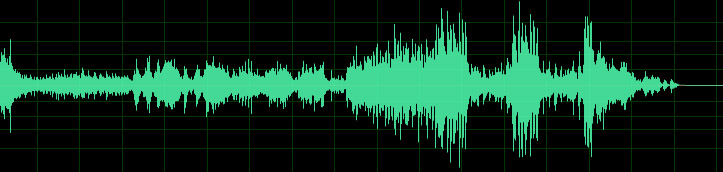
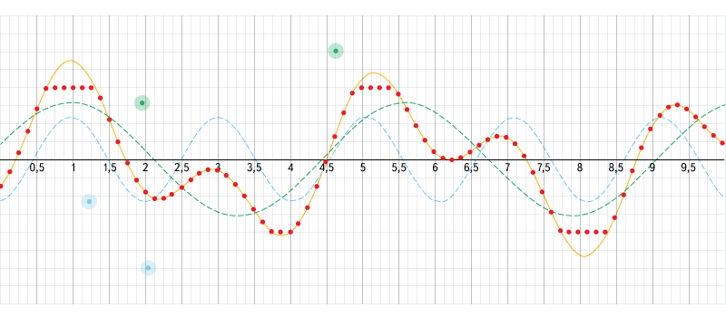
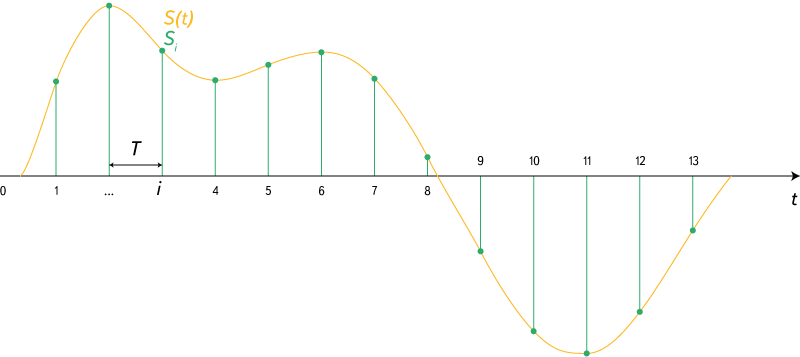
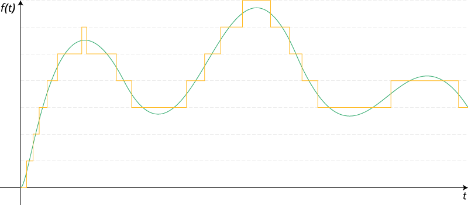
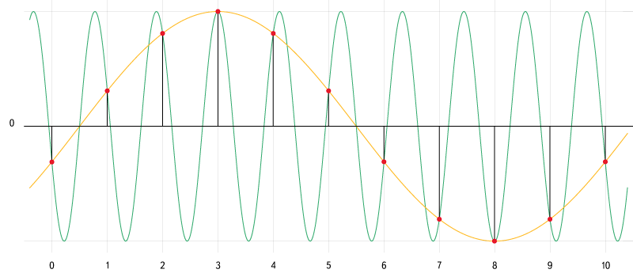
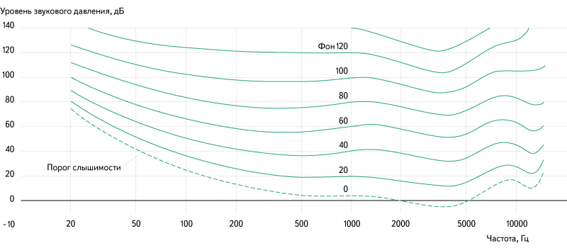
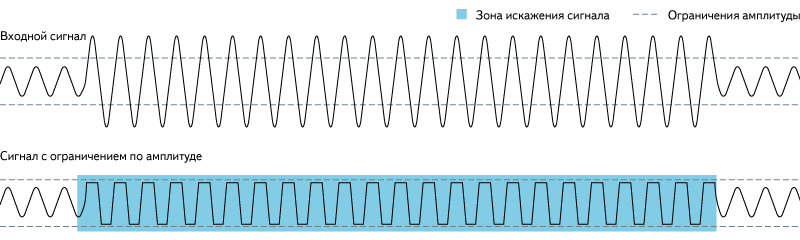

Введение в теорию звука
=======================

Я попробую на пальцах описать некоторые основные понятия, которые требуется знать, при цифровой обработке звука. 
В этом разделе нет серьёзной математики вроде быстрых преобразований Фурье и прочего - эти формулы не сложно найти в 
сети. Тут описывается только сама суть и смысл вещей с которыми придётся столкнуться.

Оцифровка, или Туда и обратно
-----------------------------

Прежде всего разберёмся с тем, что такое цифровой сигнал, как он получается из аналогового и откуда собственно берётся аналоговый сигнал. Последний максимально просто можно определить как колебания напряжения, возникающие из-за колебаний мембраны в микрофоне.


*Рис. 1. Осциллограмма звука*

Это осциллограмма звука - так выглядит аудио сигнал. Думаю, каждый хоть раз в жизни видел подобные картинки. Для того чтобы понять, как устроен процесс преобразования аналогового сигнала в цифровой, нужно нарисовать осциллограмму звука на миллиметровой бумаге. Для каждой вертикальной линии найдем точку пересечения с осциллограммой и ближайшее целое значение по вертикальной шкале — набор таких значений и будет простейшей записью цифрового сигнала.

[](https://www.desmos.com/calculator/aojmanpjrl)
*Рис. 2. Интерактивный пример сложения волн и оцифровки сигнала.
Источник: https://www.desmos.com/calculator/aojmanpjrl*

Воспользуемся этим интерактивным примером, чтобы разобраться в том, как накладываются друг на друга волны разной частоты и как происходит оцифровка. В левом меню можно включать/выключать отображение графиков, настраивать параметры входных данных и параметры дискретизации, а можно просто двигать контрольные точки.

На [аппаратном уровне это](https://en.wikipedia.org/wiki/Analog-to-digital_converter), разумеется, выглядит значительно сложнее, и в зависимости от аппаратуры сигнал может кодироваться совершенно разными способами. Самым распространённым из них является [импульсно-кодовая модуляция](https://en.wikipedia.org/wiki/Pulse-code_modulation), при которой записывается не конкретное значение уровня сигнала в каждый момент времени, а разница между текущим и предыдущим значением. Это позволяет снизить количество бит на каждый отсчёт примерно на 25%. Этот способ кодирования применяется в наиболее распространённых аудио-форматах (WAV, MP3, WMA, OGG, FLAC, APE), которые используют контейнер [PCM WAV](http://wav-pcm.narod.ru/).

В реальности для создания стерео-эффекта при записи аудио чаще всего записывается не один, а сразу несколько каналов. В зависимости от используемого формата хранения они могут храниться независимо. Также уровни сигнала могут записываться как разница между уровнем основного канала и уровнем текущего.

Обратное преобразование из цифрового сигнала в аналоговый производится с помощью [цифро-аналоговых преобразователей](https://en.wikipedia.org/wiki/Digital-to-analog_converter), которые могут иметь различное устройство и принципы работы. Я опущу описание этих принципов в данной статье.

Дискретизация
-------------

Как известно, цифровой сигнал — это набор значений уровня сигнала, записанный через заданные промежутки времени. Процесс преобразования непрерывного аналогового сигнала в цифровой сигнал называется дискретизацией (по времени и по уровню). Есть две основные характеристики цифрового сигнала - частота дискретизации и глубина дискретизации по уровню.


*Рис. 3. Дискретизация сигнала.
Источник: [https://en.wikipedia.org/wiki/Sampling_(signal_processing)](https://en.wikipedia.org/wiki/Sampling_(signal_processing))*

[Частота дискретизации](https://en.wikipedia.org/wiki/Sampling_(signal_processing)#Sampling_rate) указывает на то, с какими интервалами по времени идут данные об уровне сигнала. Существует [теорема Котельникова](https://ru.wikipedia.org/wiki/Теорема_Котельникова) (в западной литературе её упоминают как [теорему Найквиста - Шеннона](https://en.wikipedia.org/wiki/Nyquist–Shannon_sampling_theorem), хотя встречается и название Котельникова - Шеннона), которая утверждает: для возможности точного восстановления аналогового сигнала из дискретного требуется, чтобы частота дискретизации была минимум в два раза выше, чем максимальная частота в аналоговом сигнале. Если брать примерный диапазон воспринимаемых человеком частот звука 20 Гц - 20 кГц, то оптимальная частота дискретизации ([частота Найквиста](https://en.wikipedia.org/wiki/Nyquist_frequency)) должна быть в районе 40 кГц. У стандартных аудио-CD она составляет 44.1 кГц


*Рис. 4. Квантование сигнала.
Источник: [https://ru.wikipedia.org/wiki/Квантование_(обработка сигналов)](https://ru.wikipedia.org/wiki/Квантование_(обработка сигналов))*

[Глубина дискретизации](https://ru.wikipedia.org/wiki/Квантование_(обработка_сигналов)) по уровню описывает разрядность числа, которым описывается уровень сигнала. Эта характеристика накладывает ограничение на точность записи уровня сигнала и на его минимальное значение. Стоит специально отметить, что данная характеристика не имеет отношения к громкости - она отражает точность записи сигнала. Стандартная глубина дискретизации на audio-CD — 16 бит. При этом, если не использовать специальную студийную аппаратуру, разницу в звучании большинство перестаёт замечать уже в районе 10-12 бит. Однако большая глубина дискретизации позволяет избежать появления шумов при дальнейшей обработке звука.

Шумы
----

В цифровом звуке можно выделить три основных источника шумов.

### Джиттер
Это случайные отклонения сигнала, как правило, возникающие из-за нестабильности частоты задающего генератора или различной скорости распространения разных частотных составляющих одного сигнала. Данная проблема возникает на стадии оцифровки. Если описывать <s>«на пальцах»</s> «на миллиметровке», это происходит из-за немного разного расстояния между вертикальными линиями.

### Шум дробления
Он напрямую связан с глубиной дискретизации. Так как при оцифровке сигнала его реальные значения округляются с определённой точностью, возникают слабые шумы, связанные с её потерей. Эти шумы могут появляться не только на стадии оцифровки, но и в процессе цифровой обработки (например, если сначала уровень сигнала сильно понижается, а затем — снова повышается).

### Алиасинг
При оцифровке возможна ситуация, при которой в цифровом сигнале могут появиться частотные составляющие, которых не было в оригинальном сигнале. Данная ошибка получила название [Aliasing](https://en.wikipedia.org/wiki/Aliasing). Этот эффект напрямую связан с частотой дискретизации, а точнее — с частотой Найквиста. Проще всего понять, как это происходит, рассмотрев вот эту картинку:


*Рис. 5. Алиас. Источник: https://ru.wikipedia.org/wiki/Алиасинг*

Зелёным показана частотная составляющая, частота которой выше частоты Найквиста. При оцифровке такой частотной составляющей не удаётся записать достаточно данных для её корректного описания. В результате при воспроизведении получается совершенно другой сигнал - жёлтая кривая.

### Уровень сигнала
Для начала стоит сразу понять, что когда речь идёт о цифровом сигнале, то можно говорить только об относительном уровне сигнала. Абсолютный зависит в первую очередь от воспроизводящей аппаратуры и прямо пропорционален относительному. При расчётах относительных уровней сигнала принято использовать [децибелы](https://en.wikipedia.org/wiki/Decibel). При этом за точку отсчёта берётся сигнал с максимально возможной амплитудой при заданной глубине дискретизации. Этот уровень указывается как 0 dBFS (dB - децибел, FS = Full Scale - полная шкала). Более низкие уровни сигнала указываются как -1 dBFS, -2 dBFS и т.д. Вполне очевидно, что более высоких уровней просто не бывает (мы изначально берём максимально возможный уровень).

Поначалу бывает тяжело разобраться с тем, как соотносятся децибелы и реальный уровень сигнала. На самом деле всё просто. Каждые ~6 dB (точнее 20 log(2) ~ 6.02 dB) указывают на изменение уровня сигнала в два раза. То есть, когда мы говорим о сигнале с уровнем -12 dBFS, понимаем, что это сигнал, уровень которого в четыре раза меньше максимального, а -18 dBFS - в восемь, и так далее. Если посмотреть на определение децибела, в нём указывается значение  - тогда откуда берётся 20? Всё дело в том, что децибел - это логарифм отношения двух одноимённых энергетических величин, умноженный на 10. Амплитуда же не является <b>энергетической</b> величиной, следовательно её нужно перевести в подходящую величину. Мощность, которую переносят волны с разными амплитудами, пропорциональна квадрату амплитуды. Следовательно для амплитуды (если все прочие условия, кроме амплитуды принять неизменными) формулу можно записать как %2020%20log(a%2Fa_0)" alt="10log(a^2/a0^2) => 20log(a/a0)" />

**N.B.** Стоит упомянуть, что логарифм в данном случае берётся десятичный, в то время как большинство библиотек под функцией с названием log подразумевает натуральный логарифм.

При различной глубине дискретизации уровень сигнала по этой шкале изменяться не будет. Сигнал с уровнем -6 dBFS останется сигналом с уровнем -6 dBFS. Но всё же одна характеристика изменится - динамический диапазон. Динамический диапазон сигнала - это разница между его минимальным и максимальным значением. Он рассчитывается по формуле , где n - глубина дискретизации (для грубых оценок можно пользоваться более простой формулой: n * 6). Для 16 бит это ~96.33 dB, для 24 бит ~144.49 dB. Это означает, что самый большой перепад уровня, который можно описать с 24-битной глубиной дискретизации (144.49 dB), на 48.16 dB больше, чем самый большой перепад уровня с 16-битной глубиной (96.33 dB). Плюс к тому — шум дробления при 24 битах на 48 dB тише. 

Восприятие
----------

Когда мы говорим о восприятии звука человеком, следует сначала разобраться, каким образом люди воспринимают звук. Очевидно, что мы слышим с помощью [ушей](https://en.wikipedia.org/wiki/Ear). Звуковые волны взаимодействуют с барабанной перепонкой, смещая её. Вибрации передаются во внутреннее ухо, где их улавливают рецепторы. То, насколько смещается барабанная перепонка, зависит от такой характеристики, как [звуковое давление](https://en.wikipedia.org/wiki/Sound_pressure). При этом [воспринимаемая громкость](https://en.wikipedia.org/wiki/Loudness) зависит от звукового давления не напрямую, а логарифмически. Поэтому при изменении громкости принято использовать относительную шкалу SPL (уровень звукового давления), значения которой указываются всё в тех же децибелах. Стоит также заметить, что воспринимаемая громкость звука зависит не только от уровня звукового давления, но ещё и от частоты звука:


*Рис. 6. Зависимость воспринимаемой громкости от частоты и амплитуды звука.
Источник: https://ru.wikipedia.org/wiki/Громкость_звука*

Громкость
---------

Простейшим примером обработки звука является изменение его громкости. При этом происходит просто умножение уровня сигнала на некоторое фиксированное значение. Однако даже в таком простом деле, как регулировка громкости, есть один подводный камень. Как я уже отметил ранее, воспринимаемая громкость зависит от логарифма звукового давления, а это значит, что использование линейной шкалы громкости оказывается не очень эффективным. При линейной шкале громкости возникает сразу две проблемы - для ощутимого изменения громкости, когда ползунок находится выше середины шкалы приходится достаточно далеко его сдвигать, при этом ближе к самому низу шкалы сдвиг меньше, чем на толщину волоса, может изменить громкость в два раза (думаю, с этим каждый сталкивался). Для решения данной проблемы используется логарифмическая шкала громкости. При этом на всей её длине передвижение ползунка на фиксированное расстояние меняет громкость в одинаковое количество раз. В профессиональной записывающей и обрабатывающей аппаратуре, как правило, используется именно логарифмическая шкала громкости.

Математика
----------

Тут я, пожалуй, немного вернусь к математике, потому что реализация логарифмической шкалы оказывается не такой простой и очевидной вещью для многих, а найти в интернете данную формулу не так просто, как хотелось бы. Заодно покажу, как просто переводить значения громкости в dBFS и обратно. Для дальнейших объяснений это будет полезным.

```(javascript)
// Минимальное значение громкости - на этом уровне идёт отключение звука
var EPSILON = 0.001;

// Коэффициент для преобразований в dBFS и обратно
var DBFS_COEF = 20 / Math.log(10);

// По положению на шкале вычисляет громкость
var volumeToExponent = function(value) {
	var volume = Math.pow(EPSILON, 1 - value);
	return volume > EPSILON ? volume : 0;
};

// По значению громкости вычисляет положение на шкале
var volumeFromExponent = function(volume) {
	return 1 - Math.log(Math.max(volume, EPSILON)) / Math.log(EPSILON);
};

// Перевод значения громкости в dBFS
var volumeToDBFS = function(volume) {
	return Math.log(volume) * DBFS_COEF;
};

// Перевод значения dBFS в громкость
var volumeFromDBFS = function(dbfs) {
	return Math.exp(dbfs / DBFS_COEF);
}
```

Цифровая обработка
------------------

Теперь вернёмся к тому, что мы имеем цифровой, а не аналоговый сигнал. У цифрового сигнала есть две особенности, которые стоит учитывать при работе с громкостью:

  - точность, с которой указывается уровень сигнала, ограничена (причём достаточно сильно. 16 бит - это в 2 раза меньше, чем используется для стандартного числа с плавающей точкой);
  - у сигнала есть верхняя граница уровня, за которую он не может выйти.

Из того, что уровень сигнала имеет ограничение точности, следует две вещи:

  - уровень шумов дробления возрастает при увеличении громкости. Для малых изменений обычно это не очень критично, так как изначальный уровень шума значительно тише ощутимого, и его можно безопасно поднимать в 4-8 раз (например, применять эквалайзер с ограничением шкалы в ±12dB);
  - не стоит сначала сильно понижать уровень сигнала, а затем сильно его повышать - при этом могут появиться новые шумы дробления, которых изначально не было.

Из того, что сигнал имеет верхнее ограничение уровня, следует, что нельзя безопасно увеличивать громкость выше единицы. При этом пики, которые окажутся выше границы, будут «срезаны» и произойдёт потеря данных.


*Рис. 7. Клиппинг. 
Источник: [https://en.wikipedia.org/wiki/Clipping_(audio)](https://en.wikipedia.org/wiki/Clipping_(audio))*

На практике всё это означает, что стандартные для Audio-CD параметры дискретизации (16 бит, 44,1 кГц) не позволяют производить качественную обработку звука, потому что имеют очень малую избыточность. Для этих целей лучше использовать более избыточные форматы. Однако стоит учитывать, что общий размер файла пропорционален параметрам дискретизации, поэтому выдача таких файлов для он-лайн воспроизведения - не лучшая идея.

Измерение громкости
-------------------

Для того чтобы сравнивать громкость двух разных сигналов, её для начала нужно как-то измерить. Существует по меньшей мере три метрики для измерения громкости сигналов - максимальное пиковое значение, усреднённое значение уровня сигнала и метрика ReplayGain.

Максимальное пиковое значение достаточно слабая метрика для оценки громкости. Она никак не учитывает общий уровень громкости - например, если записать грозу, то большую часть времени на записи будет тихо шелестеть дождь и лишь пару раз прогремит гром. Максимальное пиковое значение уровня сигнала у такой записи будет довольно высоким, но большая часть записи будет иметь весьма низкий уровень сигнала. Однако эта метрика всё равно является полезной - она позволяет вычислить максимальное усиление, которое можно применить к записи, при котором не будет потерь данных из-за «обрезания» пиков.

Усреднённое значение уровня сигнала — более полезная метрика и легко вычислимая, но всё же имеет существенные недостатки, связанные с тем, как мы воспринимаем звук. Визг циркулярной пилы и рокот водопада, записанные с одинаковым средним уровнем сигнала, будут восприниматься совершенно по-разному.

[ReplayGain](https://en.wikipedia.org/wiki/ReplayGain) наиболее точно передает воспринимаемый уровень громкости записи и учитывает физиологические и психические особенности восприятия звука. Для промышленного выпуска записей многие звукозаписывающие студии используют именно её, также она поддерживается большинством популярных медиа-плееров. ([Русская статья](https://ru.wikipedia.org/wiki/ReplayGain) на WIKI содержит много неточностей и фактически не корректно описывает саму суть технологии)

Нормализация громкости
----------------------

Если мы можем измерять громкость различных записей, мы можем её нормализовать. Идея нормализации состоит в том, чтобы привести разные звуки к одинаковому уровню воспринимаемой громкости. Для этого используется несколько различных подходов. Как правило, громкость стараются максимизировать, но это не всегда возможно из-за ограничений максимального уровня сигнала. Поэтому обычно берётся некоторое значение немного меньше максимума (например -14 dBFS), к которому пытаются привести все сигналы.

Иногда нормализацию громкости производят в рамках одной записи - при этом различные части записи усиливают на разные величины, чтобы их воспринимаемая громкость была одинаковой. Такой подход очень часто применяется в компьютерных видео-плеерах - звуковая дорожка многих фильмов может содержать участки с очень сильно отличающейся громкостью. В такой ситуации возникают проблемы при просмотре фильмов без наушников в позднее время - при громкости, на которой нормально слышен шёпот главных героев, выстрелы способны перебудить соседей. А на громкости, при которой выстрелы не бьют по ушам, шёпот становится вообще неразличим. При внутри-трековой нормализации громкости плеер автоматически увеличивает громкость на тихих участках и понижает на громких. Однако этот подход создаёт ощутимые артефакты воспроизведения при резких переходах между тихим и громким звуком, а также порой завышает громкость некоторых звуков, которые по задумке должны быть фоновыми и еле различимыми.

Также внутреннюю нормализацию порой производят, чтобы повысить общую громкость треков. Это называется нормализацией с компрессией. При этом подходе среднее значение уровня сигнала максимизируется за счёт усиления всего сигнала на заданную величину. Те участки, которые должны были быть подвергнуты «обрезанию», из-за превышения максимального уровня усиливаются на меньшую величину, позволяя избежать этого. Этот способ увеличения громкости значительно снижает качество звучания трека, но, тем не менее, многие звукозаписывающие студии не брезгуют его применять.

Фильтрация
----------

**НАПИСАТЬ ПРО АМПЛИТУДНУЮ ХАРАКТЕРИСТИКУ**

**НАПИСАТЬ ПРО ФАЗОВУЮ ХАРАКТЕРИСТИКУ**

**НАПИСАТЬ ПРО ИМПУЛЬСНУЮ ХАРАКТЕРИСТИКУ**

**НАПИСАТЬ ПРО ГРУППОВУЮ ЗАДЕРЖКУ**

### Фильтры КИХ

**НАПИСАТЬ ПРО РАБОТУ ФИЛЬТРОВ КИХ**

### Фильтры БИХ

**НАПИСАТЬ ПРО РАБОТУ ФИЛЬТРОВ БИХ**

Материалы
---------

**ПОЧИСТИТЬ СПИСОК МАТЕРИАЛОВ**

  - [О понятии громкости в цифровом представлении звука и о методах её повышения](http://audiophilesoft.ru/publ/my/digital_loudness/11-1-0-86)
  - [Звук](https://ru.wikipedia.org/wiki/Звук)
  - [Амплитуда](https://ru.wikipedia.org/wiki/Амплитуда)
  - [Частота](https://ru.wikipedia.org/wiki/Частота)
  - [Цифровой сигнал](https://ru.wikipedia.org/wiki/Цифровой_сигнал)
  - [Аналоговый сигнал](https://ru.wikipedia.org/wiki/Аналоговый_сигнал)
  - [Цифровая обработка сигналов](https://ru.wikipedia.org/wiki/Цифровая_обработка_сигналов)
  - [Интерактивный пример сложения волн и оцифровки сигнала](https://www.desmos.com/calculator/aojmanpjrl)
  - [Аналогово-цифровой преобразователь](https://ru.wikipedia.org/wiki/Аналого-цифровой_преобразователь)
  - [Цифро-аналоговый преобразователь](https://ru.wikipedia.org/wiki/Цифро-аналоговый_преобразователь)
  - [Импульсно-кодовая модуляция](https://ru.wikipedia.org/wiki/Импульсно-кодовая_модуляция)
  - [Формат PCM WAV](http://wav-pcm.narod.ru/)
  - [Сэмплирование (en)](https://en.wikipedia.org/wiki/Sampling_%28signal_processing%29)
  - [Частота дискретизации](https://ru.wikipedia.org/wiki/Частота_дискретизации)
  - [Теорема Котельникова](https://ru.wikipedia.org/wiki/Теорема_Котельникова)
  - [Частота Найквиста](https://ru.wikipedia.org/wiki/Частота_Найквиста)
  - [Глубина дискретизации](https://ru.wikipedia.org/wiki/Квантование_%28обработка_сигналов%29)
  - [Alias](https://ru.wikipedia.org/wiki/Алиасинг)
  - [Децибел](https://ru.wikipedia.org/wiki/Децибел)
  - [Строение уха](https://ru.wikipedia.org/wiki/Ухо)
  - [Звуковое давление](https://ru.wikipedia.org/wiki/Звуковое_давление)
  - [Воспринимаемая громкость](https://ru.wikipedia.org/wiki/Громкость_звука)
  - [Клиппинг](https://en.wikipedia.org/wiki/Clipping_%28audio%29)
  - [ReplayGain описание](https://en.wikipedia.org/wiki/ReplayGain)
  - [ReplayGain спецификация](http://wiki.hydrogenaud.io/index.php?title=ReplayGain_specification)
  - [Быстрое преобразование Фурье](http://habrahabr.ru/post/196374/), [вики](https://ru.wikipedia.org/wiki/Быстрое_преобразование_Фурье), [wiki](https://en.wikipedia.org/wiki/Fast_Fourier_transform)
  - [Импульсная характеристика](https://ru.wikipedia.org/wiki/Импульсная_переходная_функция)
  - [Фазо-частотная характеристика](https://ru.wikipedia.org/wiki/Фазо-частотная_характеристика)
  - [Амплитудо-частотная характеристика](https://ru.wikipedia.org/wiki/Амплитудно-частотная_характеристика)
  - [Фильтр с бесконечной импульсной характеристикой](https://ru.wikipedia.org/wiki/Фильтр_с_бесконечной_импульсной_характеристикой)
  - [Фильтр с конечной импульсной характеристикой](https://ru.wikipedia.org/wiki/Фильтр_с_конечной_импульсной_характеристикой)
  - [Биквадратный фильтр (en)](https://en.wikipedia.org/wiki/Digital_biquad_filter)
  - [BiquadFilterNode](https://developer.mozilla.org/ru/docs/Web/API/BiquadFilterNode)
  - [HTML5 Audio W3C](http://www.w3.org/TR/html5/embedded-content-0.html#the-audio-element)
  - [Web Audio API](https://developer.mozilla.org/en-US/docs/Web/API/AudioContext)
  - [Вейвшейпер](http://wikisound.org/Waveshaper)
  - [Дисторшн](https://ru.wikipedia.org/wiki/Дисторшн)
  - [Овердрайв](https://ru.wikipedia.org/wiki/Овердрайв_%28звуковой_эффект%29)
  - [Фузз](https://ru.wikipedia.org/wiki/Фузз_%28эффект%29)
  - [Реверберации](https://ru.wikipedia.org/wiki/Реверберация)
  - [Свёртка](https://ru.wikipedia.org/wiki/Свёртка_%28математический_анализ%29)
  - [Эквалайзер](https://ru.wikipedia.org/wiki/Эквалайзер)

Полезные ссылки
---------------

  - [визуализация синусоид](http://toxicdump.org/stuff/FourierToy.swf)
  - [генерация звука с множеством параметров](http://www.bfxr.net/)
  - [языки программирования звука](https://en.wikipedia.org/wiki/List_of_audio_programming_languages)
  - алгоритмические генераторы звука: [wavepot.com](http://wavepot.com/), [studio.substack.net](http://studio.substack.net/), [wurstcaptures.untergrund.net](http://wurstcaptures.untergrund.net/music/)
  - [визуальный конструктор фильтров Web Audio API](http://webaudioplayground.appspot.com/)
  - [визуальная студия аудио-обработки](http://app.hya.io/) 

Благодарности
-------------

Большое спасибо моим коллегам, которые помогали собирать материалы для этой статьи и давали полезные советы.

Отдельное спасибо 
  - Тарасу [@Audiophile](http://habrahabr.ru/users/audiophile/) Ковриженко за описание алгоритмов нормализации и максимизации громкости,
  - Сергею [@forgotten](http://habrahabr.ru/users/forgotten/) Константинову за большое количество пояснений и советов по данной статье, 
  - Денису [@deniskreshikhin](http://habrahabr.ru/users/deniskreshikhin/) Крешихину и Никите [@merlin-vrn](http://habrahabr.ru/users/merlin-vrn/) Киприянову за комментарии по работе цифровых фильтров.

Большое спасибо [@dtestyk](http://habrahabr.ru/users/dtestyk/) за список полезных ссылок.
