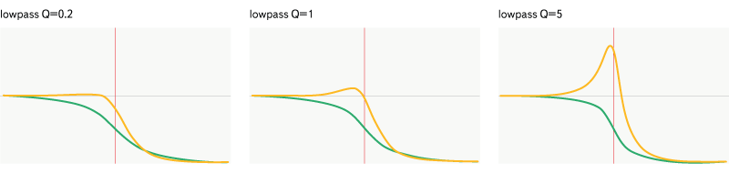
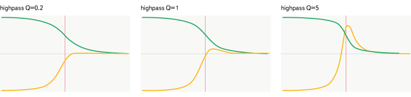
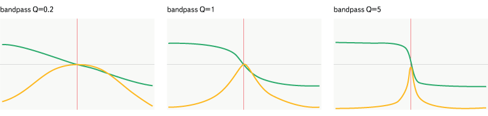
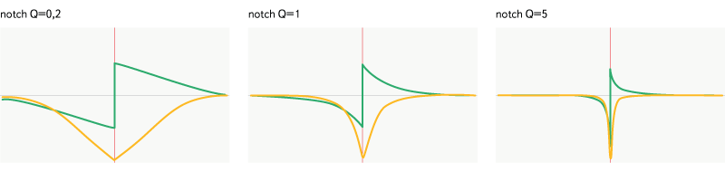
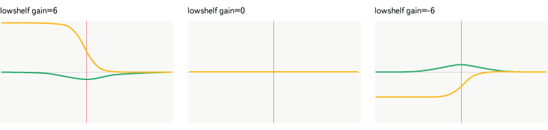
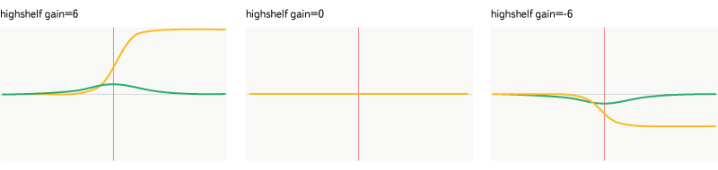
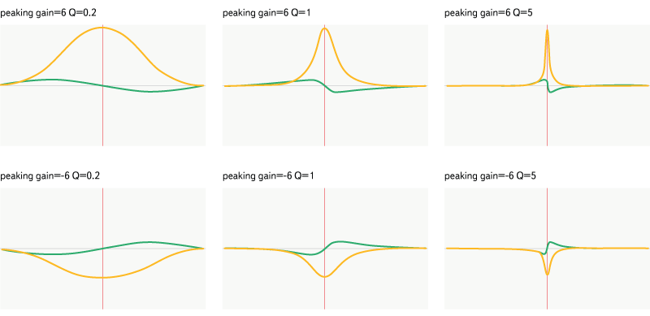
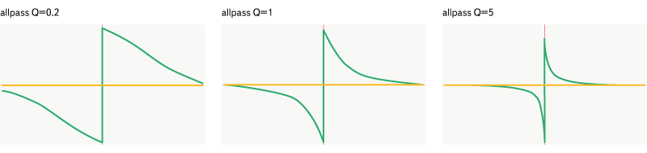

Web Audio API
=============

Web Audio API - это технология, позволяющая существенно расширить возможности воспроизведения звука в браузере. К сожалению эта технология на данный момент очень молодая и её поддержка есть только в свежих версиях популярных десктопных браузеров и практически отсутствует в мобильных браузерах.
  
У Web Audio API стоит выделить 3 основных аспекта, которые особо не пересекаются и их можно рассматривать отдельно:
 
  - возможности работы с различными источниками сигнала
  - возможности по анализу сигнала
  - возможности по цифровой обработке сигнала

В этой статье я постараюсь объяснить назначение каждого элемента. Она получается и так достаточно большой, так что большую часть информации о интерфейсах я опустил - она доступна по ссылкам на документацию - а основное внимание сосредоточил на вещах, которые не очевидны после прочтения документации.

Работа с Web Audio API
----------------------

Центральный элемент данного API - это `AudioContext` ([man](https://developer.mozilla.org/en-US/docs/Web/API/AudioContext)). Данный элемент предоставляет все необходимые фабрики для создания остальных элементов, а так же имеет методы для управления состоянием всего графа (`AudioContext#resume`, `AudioContext#suspend`). Плюс к тому через данный элемент можно получать информацию о таких вещах как время воспроизведения (`AudioContext#currentTime`), частоте дискретизации (`AudioContext#sampleRate`), текущем статусе графа.

### Построение графа

Как уже стало понятно из предыдущего абзаца, элементы Web Audio API связываются в некий граф, в котором определён порядок передачи сигнала от отного элемента другому. Все элементы связываемые таким образом являются потомками класса `AudioNode` ([man](https://developer.mozilla.org/en-US/docs/Web/API/AudioNode))

Для простоты назовём сигнал передающийся между 2 элементами `AudioNode` потоком. У каждого элемента есть какое-то количество входов и выходов потока. Не стоит путать количество входов с количеством подключенных потоков. К любому входу можно подключить неограниченное количество потоков. Аналогично дела обстоят с выходами. Большинство элементов имеет по 1 входу и выходу. Источники сигнала не имеют входов, а выводящие элементы (которые воспроизводят звук или создают сетевой поток), не имеют выходов. 
  
  - `AudioNode#connect` ([man](https://developer.mozilla.org/en-US/docs/Web/API/AudioNode/connect%28AudioNode%29)) - данный метод подключает один элемент к другому, создавая поток. Данный метод принимает 3 аргумента - элемент назначения, номер выхода текущего элемента, который следует использовать, номер входа к которому нужно подключить текущий элемент. Элементом назначения может быть не только `AudioNode`, но и `AudioParam` - это позволяет контролировать некий параметр с помощью аудио-сигнала. Я расскажу об этой возможности подробнее в разделе про обработку сигнала
  - `AudioNode#disconnect` ([man](https://developer.mozilla.org/en-US/docs/Web/API/AudioNode/disconnect)) - данный метод отключает все исходящие потоки. В документации указано, что у данного метода есть необязательные аргументы, аналогичные методу `AudioNode#connect`, но на деле поддержка этих аргументов есть только в последних версиях Chrome

Также стоит отдельно рассмотреть 2 элемента, которые позволяют разделять и объединять каналы:

  - `ChannelSplitterNode` ([man](https://developer.mozilla.org/en-US/docs/Web/API/ChannelSplitterNode)) - элемент который принимает на вход один много-канальный поток и выдаёт набор моно-канальных потоков
  - `ChannelMergerNode` ([man](https://developer.mozilla.org/en-US/docs/Web/API/ChannelMergerNode)) - элемент, который принимает на вход множество моно-канальных потоков и выдаёт один много-канальный поток

### Каналы 

Стоит отдельно упомянуть про работу с многоканальным звуком. Каждый элемент `AudioNode` имеет свои параметры указывающие на количество каналов, с которыми он работает и то, каким образом данные каналы следует интерпретировать.

  - `AudioNode#channelCount` - настройка количества используемых каналов.
  - `AudioNode#channelCountMode` - настройка автоматического рассчёта количества каналов. Принимает одно из значений:
    * `"max"` - количество каналов выбирается равным максимальному количеству каналов у подключенных источников.
    * `"clamped-max"` - аналогично `"max"`, но значение ограничено сверху параметром `AudioNode#channelCount`
    * `"explicit"` - автоматический рассчёт отключен, количество каналов точно равно `AudioNode#channelCount`
  - `AudioNode#channelInterpretation` - ([man](https://developer.mozilla.org/en-US/docs/Web/API/AudioNode/channelInterpretation)) самая интересная настройка. Она отвечает за то, что будет происходить если соединить 2 элемента у которых разное количество каналов. Параметр может принимать одно из значений
    * `"speakers"` - каналы рассматриваются, как каналы стандартной воспроизводящей аппаратуры (см. таблицу в [документации](https://developer.mozilla.org/en-US/docs/Web/API/AudioNode/channelInterpretation)). При расхождении в количестве каналов происходит автоматическое смешение каналов (если на вход подаётся больше каналов, чем у элемента) или разделение (если на вход подаётся меньше каналов, чем у элемента) 
    * `"discrete"` - смешение и разделение каналов отключено
    
Для большинства элементов `AudioNode#channelCountMode` выставлен в значение `"max"`, так что при работе с ними можно не обращать внимания на все эти настройки. Рассмотрим отдельно элементы в которых используются другие значения.

  - `PannerNode` - для этого элемента существует 2 ограничения
    - значение `PannerNode#channelCountMode` может быть только `"clamped-max"` или `"explicit"`
    - значение `PannerNode#channelCount` можеть быть только 1 или 2
  - `ConvolverNode` - для этого элемента значения по-умолчанию `ConvolverNode#channelCountMode = "clamped-max"` и `ConvolverNode#channelCount = 2`, но их можно произвольно менять. Однако есть ограничение на количество каналов буфера, используемого при рассчёте свёртки - их может быть 1, 2 или 4.
  - `AudioDestinationNode` - для этого элемента значения по-умолчанию `AudioDestinationNode#channelCountMode = "explicit"` и `AudioDestinationNode#channelCount = 2`. Можно выставить любое значение для автоматического рассчёта количества каналов, но для настройки `AudioDestinationNode#channelCount` есть ограничение в количество каналов, которое поддерживается системой. Это значение можно узнать из `AudioDestinationNode#maxChannelCount`.
  - `AnalyserNode` - по умолчанию имеет ровно 1 канал. Эту настройку можно изменять как угодно. Но если количество каналов больше 1, то данные для буфера для анализа будут браться как усреднённое значение всех доступных каналов. Кстати, т.к. используется всего 1 канал, при анализе звука лучше использовать этот элемент параллельно с основной линией вывода звука, а не встраивать его в неё, как показано в документации.
  - `DynamicsCompressorNode` - по-умолчанию имеет настройки `DynamicsCompressorNode#channelCountMode = "explicit"` и `DynamicsCompressorNode#channelCount = 2`. Однако данный элемент не имеет никаких ограничений в настройках (почему и для чего разработчики выставили такие параметры по-умолчанию остаётся загадкой).
  
Ну и рассказывая про работу с каналами, нельзя не упомянуть про `StereoPannerNode` ([man](https://developer.mozilla.org/en-US/docs/Web/API/StereoPannerNode)), который позволяет регулировать балланс каналов. Данный элемент позволяет усиливать звук в одном канале, одновременно ослабляя его в другом канале.

Каналы вывода
-------------

Web Audio API может использовать для вывода результирующего сигнала системное аудио-устройство или медиа-поток. Плюс к тому существует специальный контекст `OfflineAudioContext`, который позволяет выводить данные в аудио-буфер. Элементы которые реализуют данный функционал являются `AudioNode` - достаточно добавить их в граф присоединив к нужным нодам, чтобы начался вывод данных.

### [AudioDestinationNode](https://developer.mozilla.org/en-US/docs/Web/API/AudioDestinationNode)

Данный элемент нельзя создать - он является свойством `#destination` аудио-контекста и в зависимости от того какой это контекст может использоваться либо для вывода звука через системное аудио-устройство (если используется `AudioContext`), либо для записи аудио-буфера (если используется `OfflineAudioContext`).

### [MediaStreamAudioDestinationNode](https://developer.mozilla.org/en-US/docs/Web/API/MediaStreamAudioDestinationNode)

Данный элемент позволяет выводить аудио-сигнал в медиа-поток `MediaStream`, который создаётся при вызове фабрики `AudioContext#createMediaStreamDestination` ([man](https://developer.mozilla.org/en-US/docs/Web/API/AudioContext/createMediaStreamDestination)). После создания элемента медиа-поток доступен через свойство `MediaStreamAudioDestinationNode#stream` ([man](https://developer.mozilla.org/en-US/docs/Web/API/MediaStreamAudioDestinationNode/stream))

Источники сигнала
-----------------

Web Audio API работает с цифровыми сигналами, которые могут быть получены из самых разных источников или созданы непосредственно с помощью скриптов. Элементы Web Audio API, которые могут генерировать некий сигнал будем называть источниками сигнала, а любые посторониие объекты, которые могут быть использованы для генерации этого сигнала будем называть источниками данных.

В отличие от медиа-элементов у Web Audio API нет методов получения данных по сети или из файловой системы. Вместо этого есть 3 типа источников данных, которые позволяют решать проблему получения данных самыми разнообразными способами, которые не доступны медиа-элементам.

### [MediaElementAudioSourceNode](https://developer.mozilla.org/en-US/docs/Web/API/MediaElementAudioSourceNode)

Начнём с самого простого. Источником данных этого элемента является `<audio>` или `<video>` элемент. 

Фабрика `AudioContext#createMediaElementSource` ([man](https://developer.mozilla.org/en-US/docs/Web/API/AudioContext/createMediaElementSource)) принимает в качестве единственного параметра медиа-элемент (`<audio>` или `<video>`). При этом создание `MediaElementAudioSourceNode` перенапрявляет вывод аудио-потока из медиа-элемента в данный объект. Остальное поведение медиа-элемента при этом не изменяется. 

Стоит отметить 3 вещи:
  
   - у медиа-элемента по прежнему работают функции изменения громкости. Для целей воспроизведения это может не иметь особого значения, но если требуется проводить анализ сигнала лучше всего выставить медиа-элементу максимальную громкость, а итоговую громкость на выходе регулировать с помощью GainNode (об этом ещё будет рассказано позднее)
   - Web Audio API требует специальных прав на получение данных из медиа-элемента. Если трек загружается с другого сервера, то для корректной работы `MediaElementAudioSourceNode` требуется, чтобы у медиа-элемента был выставлен параметр `crossOrigin` и в ответах сервера приходил корректный заголовок `Access-Control-Allow-Access`. В противном случае этот элемент нельзя будет использовать в качестве источника данных для Web Audio API.
   - нельзя отключить этот элемент от медиа-элемента. Т.е. чтобы данный медиа-элемент мог воспроизводить звук, требуется чтобы связанный с ним `MediaElementAudioSourceNode` был подключен к основному выводу контекста
   
Посмотреть реализацию можно [тут](https://github.yandex-team.ru/music/audio/blob/master/src/html5/audio-html5-loader.js#L844)

### [MediaStreamAudioSourceNode](https://developer.mozilla.org/en-US/docs/Web/API/MediaStreamAudioSourceNode)

Источником данных этого элемента является аудио-вход или любой другой источник настроенный в системе или браузере пользователя. 

Фабрика `AudioContext#createMediaStreamSource` ([man](https://developer.mozilla.org/en-US/docs/Web/API/AudioContext/createMediaStreamSource)) принимает в качестве единственного параметра медиа-поток, получаемый из метода `MediaDevices.getUserMedia` ([man](https://developer.mozilla.org/en-US/docs/Web/API/MediaDevices/getUserMedia)). Основное применение данного источника - использование микрофона или линейного входа в качестве источника аудио-данных. Тут вроде подводных камней нет.

### [AudioBufferSourceNode](https://developer.mozilla.org/en-US/docs/Web/API/AudioBufferSourceNode)

Источником данных этого элемента является [AudioBuffer](https://developer.mozilla.org/en-US/docs/Web/API/AudioBuffer). Это пожалуй самый интересный тип источников сигнала, т.к. он предоставляет те возможности, которые отсутсвуют у медиа-элементов. С помощью аудио-буфера можно формировать любой сигнал непосредственно в браузере (например таким образом это делается здесь [wavepot.com](http://wavepot.com/)). 

#### Непосредственное создание и заполнение буфера

Самый банальный метод - непосредственное создание и заполнение этого буфера. Фабрика `AudioContext#createBuffer` ([man](https://developer.mozilla.org/en-US/docs/Web/API/AudioContext/createBuffer)) принимает 3 параметра:

  - количество каналов
  - количество семплов
  - частоту дискретизации

Буфер может иметь до 32 каналов. Каждый канал содержит информацию о сигнале в формате PCM.

#### Декодирование сжатых аудио-данных

Также можно создать буфер из сжатых аудио-данных. Для этого используется метод `AudioContext#decodeAudioData` ([man](https://developer.mozilla.org/en-US/docs/Web/API/AudioContext/decodeAudioData)). Он принимает 2 параметра:

  - сжатые аудио-данные
  - обработчик в который будет передан объект `AudioBuffer` с декодированными данными
  
Благодаря этому методу можно не только вручную контролировать процесс загрузки данных, но и допустим сохранять их в localStorage (для больших файлов не подойдёт, но короткий "блямк" вполне можно сохранить). Однако стоит помнить про то, что буфер содержит несжатые данные. Каждый семпл в каждом канале - это 32 битное число с плавающей точкой, так что 5 минутный стерео-трек займёт 106 мегабайт памяти. Так что если вы решите загрузить целиком 9 симфонию Бетховена (длительность аудио-диска 74 минуты - длительность этой симфонии), то она займёт 783 мегабайта в моно-режиме и 1,5 гигабайта в стерео.

#### Использование [OfflineAudioContext](https://developer.mozilla.org/en-US/docs/Web/API/OfflineAudioContext)

Самый нетривиальный метод создания аудио-буффера. Элемент `OfflineAudioContext` работает примерно также как обычный `AudioContext`, но вместо вывода аудио-потока на устройства воспроизведения, он рассчитывает аудио-буфер. Конструктор (кстати это единственный элемент кроме `AudioContext`, который создаётся с помощью конструктора, а не фабрики) принимает те же параметры что и `AudioContext#createBuffer`.

Данный элемент позволяет произвести необходимые преобразования звука заранее, а затем многократно переиспользовать полученный аудио-буфер вместо повторных вычислений в рантайме. Возможности по формированию и обработке сигнала в данном случае ограничены только воображением.

Кстати, `AudioNode` привязывается к контексту в котором был создан. Нельзя объединять ноды созданные в разных контекстах. `OfflineAudioContext` является отдельным контекстом, так что для него нужны отдельные обрабатывающие ноды.

Итоговый буфер, который получается в результате работы данного контекста передаётся в событие `complete` ([OfflineAudioCompletionEvent](https://developer.mozilla.org/en-US/docs/Web/API/OfflineAudioCompletionEvent)). Также можно его получать через обещание, которое возвращает метод `OfflineAudioContext#startRendering` - однако обещания данный метод стал выдавать относительно недавно и не все браузеры поддерживают такое API.

### [OscillatorNode](https://developer.mozilla.org/en-US/docs/Web/API/OscillatorNode)

Этот элемент - самый простой и логичный генератор сигналов. Он просто генерирует периодический сигнал с заданной частотой. Форму волны при этом можно задавать указывая один из заранее заданных [типов](https://developer.mozilla.org/en-US/docs/Web/API/OscillatorNode/type) или с помощью элементов `PeriodicWave` ([man](https://developer.mozilla.org/en-US/docs/Web/API/PeriodicWave)).

`PeriodicWave` - является элементом, описывающим форму некоторой периодически повторяющейся волны. Форма волны задаётся с помощью коэффициентов для обратного Быстрого Преобразование Фурье. Максимальное колличество коэфициентов = 4096

Фабрика `AudioContext#createPeriodicWave` ([man](https://developer.mozilla.org/en-US/docs/Web/API/AudioContext/createPeriodicWave)) принимает 3 аргумента:

  - массив коэффициентов для обратного Быстрого Преобразования Фурье (действительная часть)
  - массив коэффициентов для обратного Быстрого Преобразования Фурье (мнимая часть)
  - опциональный объект `{disableNormalization: true}`, отключающий нормализацию волны

Чтобы понять как разные коэфициенты влияют на форму волны можно посмотреть данную [демонстрацию](https://www.desmos.com/calculator/lmzpimpbou). Под графиком расположены 8 контрольных точек, которые можно передвигать чтобы изменять коэффициенты. По оси x отсчитывается действительная часть коэффициента, по оси y - мнимая. Графики отображают действительную и мнимую часть волны после обратного Преобразования Фурье.

Стоит учитывать однако, что вне зависимости от количеста коэффициентов, которые будут переданы в фабрику общее количество отсчётов, которое будет использовано для обратного преобразования будет равно 4096.

Анализ сигнала
--------------

Для анализа данных аудио-потока можно использовать 2 различных подхода:

  - анализ данных непосредственно из аудио-буффера (Web Audio API в этом нам не помощник, оно только предоставит массив данных - дальше нужно самостоятельно описывать функции обработки этих данных)
  - анализ данных с помощью `AnalyserNode` ([man](https://developer.mozilla.org/en-US/docs/Web/API/AnalyserNode))
  
### AudioBuffer

Я не буду здесь расписывать каким образом можно использовать данные аудио-буфера, т.к. это не относится к Web Audio API напрямую. Получить данные любого канала можно с помощью методов `AudioBuffer#getChannelData` ([man](https://developer.mozilla.org/en-US/docs/Web/API/AudioBuffer/getChannelData)) и `AudioBuffer#copyFromChannel` ([man](https://developer.mozilla.org/en-US/docs/Web/API/AudioBuffer/copyFromChannel))

### [AnalyzerNode](https://developer.mozilla.org/en-US/docs/Web/API/AnalyserNode)

Данный элемент используется для анализа данных аудио-потока в реальном времени. Он содержит в себе буффер данных, который заполняется по мере воспроизведения потока. К этому буферу применяется Быстрое Преобразование Фурье. Данные преобразования можно получить с помощью методов

  - `AnalyserNode#getFloatFrequencyData` ([man](https://developer.mozilla.org/en-US/docs/Web/API/AnalyserNode/getFloatFrequencyData), передаёт данные в Float32Array)
  - `AnalyserNode#getByteFrequencyData` ([man](https://developer.mozilla.org/en-US/docs/Web/API/AnalyserNode/getByteFrequencyData), передаёт данные в Uint8Array)
   
Данные анализируемого буфера можно получить с помощью методов 

  - `AnalyserNode#getFloatTimeDomainData` ([man](https://developer.mozilla.org/en-US/docs/Web/API/AnalyserNode/getFloatTimeDomainData), передаёт данные в Float32Array)
  - `AnalyserNode#getByteTimeDomainData` ([man](https://developer.mozilla.org/en-US/docs/Web/API/AnalyserNode/getByteTimeDomainData), передаёт данные в Uint8Array)

#### Быстрое Преобразование Фурье

В статье про [теорию звука](https://github.yandex-team.ru/pages/music/audio/tutorial-sound.html) я постарался избежать описания данного алгоритма, но здесь стоит о нём рассказать, чтобы было понятно для чего он нужен и какие данные с помощью него можно получить.

Быстрое Преобразование Фурье (БПФ), грубо говоря, это ускоренная версия Дискретного Преобразования Фурье (ДПФ), которое позволяет для дискретного сигнала (а цифровой сигнал как раз таким и является) получить набор частотных и фазовых характеристик этого сигнала в виде набора комплексных чисел. Вообще говоря это преобразование над комплексными числами, но в цифровом сигнале у нас есть только вещественная часть, и все мнимые компоненты будут равны нулю. Конкретный алгоритм БПФ, используемый в данном случае - это алгоритм по основанию 2 и требует для своей работы буфера размером 2^n.

Чтобы понять для чего нужно ДПФ проще всего рассмотреть обратное ДПФ. Входными данными для этого преобразования является набор комплексных чисел, которые отражают частотные и фазовые характеристики некого сигнала, а выходными данными является непосредственно сам цифровой сигнал. Каков смысл этих чисел? На самом деле всё просто. Рассмотрим [демонстрацию](https://www.desmos.com/calculator/lmzpimpbou), которую я уже приводил в разделе про `PeriodicWave`. В этой демонстрации строится непрерывная бесконечная функция, а не дискретный конечный сигнал, но в плане наглядности так даже лучше. Нас будет интересовать только часть ограниченная 2 вертиальными оранжевыми линиями.

Вещественная часть самого первого аргумента всего лишь поднимает/опускает вещественную часть в результирующей функции. Мнимая часть делает тоже самое с мнимой частью функции.
 
Остальные аргументы более интересны. Модуль любого из этих чисел (длина радиус-вектора) указывает амплитуду некой синусоиды, а аргумент числа (угол наклона радиус-вектора) - фазу этой синусоиды в точке 0. Длина волны каждой синусоиды зависит от порядкового номера числа L = N / (n - 1), где L - длина волны в системе координат преобразования, N - количество отсчётов, n - порядковый номер аргумента. Таким образом второй аргумент задаёт синусоиду с длинной волны равной количеству отсчётов, третий - с длинной волны в 2 раза меньше, четвёртый - с длинной волны в 3 раза меньше и т.д. Все полученные синусоиды просто складываются друг с другом по принципу суперпозиции.

Собственно если обратное ДПФ из коэффициентов строит цифровой сигнал, то прямое ДПФ из цифрового сигнала получает эти самые коэффициенты, т.е. позволяет разложить наш сигнал в набор синусоид различной частоты.

#### Интерпретация данных AnalyzerNode

`AnalyzerNode` возвращает 2 набора данных - частотные характеристики и форму волны. Тут есть несколько подводных камней и особенностей.

Почему-то нигде в документации не описано в каком формате методы `AnalyserNode#getFloatFrequencyData` и `AnalyserNode#getByteFrequencyData` возвращают данные, сказано лишь, что эти данные получаются из БПФ. Нам известно, что БПФ возвращает набор комплексных чисел, но данный элемент выдаёт вещественные числа - они являются модулями комплексных чисел, т.е. описывают амплитуды соответствующих гармоник. Для метода `AnalyserNode#getFloatFrequencyData` данные об амплитуде указываются по шкале dBFS, а для метода `AnalyserNode#getByteFrequencyData` эта шкала ещё и перенормируется с учётом параметров `AnalyserNode#minDecibels` и `AnalyserNode.maxDecibels`. Не очевидно ещё вот что: размер данных о частотных характеристиках в 2 раза меньше, чем размер буфера (`AnalyserNode.fftSize`), а БПФ должно выдавать данные соответствующие размеру буфера. Половина данных из этих результатов просто выбрасывается. Чуть позже объясню почему для анализа она действительно мало интересна. Кстати, о том, что размер буфера данных о частотных характеристиках меньше в 2 раза чем буфер преобразования, в документации указано в описании свойства `AnalyserNode.frequencyBinCount` ([man](https://developer.mozilla.org/en-US/docs/Web/API/AnalyserNode/frequencyBinCount))

Выше была рассмотрена интерпретация значений частотных характеристик в системе координат преобразования, теперь стоит рассмотреть интерпретацию в системе координат цифрового сигнала. Чему равна реальная частота каждого из аргументов? Это зависит от 2х параметров: частоты дискретизации самого цифрового сигнала и размера буфера преобразования. Зависимость частоты от номера аргумента получается такая: D * (n - 1) / B, где D - частота дискретизации сигнала, B - размер буфера, n - номер аргумента. Из этого следует интересное свойство - середина буфера соответствует частоте Найквиста. Именно поэтому половина буфера выбрасывается из выдачи - она описывает частоты выше частоты Найквиста (частоту дискретизации сигнала можно узнать из `AudioContext#sampleRate`).

С методами `AnalyserNode#getFloatTimeDomainData` и `AnalyserNode#getByteTimeDomainData` всё несколько проще - оба метода просто возвращают значения временного буфера. Значения первого идут в диапазоне от -1 до 1, значения второго - от 0 до 255.

Обработка сигнала
----------------

Основное назначние Web Audio API - это обработка сигналов. Для этих целей есть целый арсенал различных фильтров.

### [AudioNode#connect(AudioParam)](https://developer.mozilla.org/en-US/docs/Web/API/AudioNode/connect(AudioParam))

Как я уже упомянал выше, ноду можно подключить не только к другой ноде, но и к некому параметру. В данном случае значение сигнала будет прибавляться к собственному значению данного параметра. Таким образом можно например смоделировать частотную модуляцию сигнала ([jsbin](https://jsbin.com/sojodecijo/edit?js,output))
 
```(javascript)
var oscillator = audioContext.createOscillator();
oscillator.frequency.value = 1000; // несущая частота будет 1 кГц
oscillator.start();

var modulatorGain = audioContext.createGain();
modulatorGain.gain.value = 500; // отклонение от несущей частоты будет +- 500 Гц.

soundStream.connect(modulatorGain);
modulatorGain.connect(oscillator.frequency);
oscillator.connect(analyzer);
```

### [GainNode](https://developer.mozilla.org/en-US/docs/Web/API/GainNode)

Самый простой фильтр - он просто меняет громкость сигнала. При изменении значения усиления используется специальный алгоритм, который предотвращает возникновение щелчков. В отличие от большинства других фильтров, здесь используется линейная шкала усиления, а не логарифмическая (в децибелах).

### [DelayNode](https://developer.mozilla.org/en-US/docs/Web/API/DelayNode)

Фильтр реализующий линию задержки. Фактически он создаёт задержку выходного сигнала относительно входного. Обычно используется для синхронизации различных сигналов во времени. Также данный элемент критически необходим для ситуаций, когда граф обработки сигнала содержит циклы. Если в таком графе не будет ни одного элемента `DelayNode`, то все ноды входящие в цикл будет отключены.
 
### [BiquadFilterNode](https://developer.mozilla.org/en-US/docs/Web/API/BiquadFilterNode)

Биквадратный фильтр относится к классу фильтров с бесконечной импульсной характеристикой (БИХ), он использует 2 последних отсчёта из входного сигнала, 2 последних отсчёта из выходного сигнала и текущий уровень сигнала. Эти параметры умножаются на зарнее расчитанные коэффициенты и складываются. С помощью различных коэффициентов реализуется большое количество разнообразных фильтров. Данный тип фильтров лучше всего подходит например для создания [эквалайзера](https://github.yandex-team.ru/music/audio/blob/master/src/fx/equalizer/equalizer.js). 

*Все графики ниже отображают диапазон частот от 20 Гц до 20000 Гц. Горизонтальная ось отображает частоту, по ней применяется логарифмический масштаб, вертикальная - магнитуду (жёлтый график) от 0 до 2, или фазовый сдвиг (зелёный график) от  -Pi до Pi. Частота всех фильтров (632 Гц) отмечена красной чертой на графике.*

#### Lowpass

*Рис. 1. Фильтр lowpass.*

Пропускает только частоты ниже заданной частоты. Фильтр задаётся частотой и добротностью.

#### Highpass

*Рис. 2. Фильтр highpass.*

Действует аналогично lowpass, за исключением того, что он пропускает частоты выше заданной, а не ниже.

#### Bandpass

*Рис. 3. Фильтр bandpass.*

Этот фильтр более избирателен - он пропускает только определённую полосу частот.

#### Notch

*Рис. 4. Фильтр notch.*

Является противоположностью bandpass - пропускает все частоты вне заданной полосы. Стоит, однако, отметить разность в графиках затухания воздействия и в фазовых характеристиках данных фильтров.

#### Lowshelf

*Рис. 5. Фильтр lowshelf.*

Является более «умной» версией highpass - усиливает или ослабляет частоты ниже заданной, частоты выше пропускает без изменений. Фильтр задаётся частотой и усилением.

#### Highshelf

*Рис. 6. Фильтр highshelf.*

Более умная версия lowpass - усиливает или ослабляет частоты выше заданной, частоты ниже пропускает без изменений.

#### Peaking

*Рис. 7. Фильтр peaking.*

Это уже более «умная» версия notch - он усиливает или ослабляет частоты в заданном диапазоне и пропускает остальные частоты без изменений. Фильтр задаётся частотой, усилением и добротностью.

#### Фильтр allpass

*Рис. 8. Фильтр allpass.*

Allpass отличается ото всех остальных - он не меняет амплитудные характеристики сигнала, вместо чего делает фазовый сдвиг заданных частот. Фильтр задаётся частотой и добротностью.

### [WaveShaperNode](https://developer.mozilla.org/en-US/docs/Web/API/WaveShaperNode)

Как я уже говорил в статье про теорию звука, данный фильтр может применяться для создания таких эффектов как [«дисторшн»](https://en.wikipedia.org/wiki/Distortion_(music)), [«овердрайв»](https://ru.wikipedia.org/wiki/Овердрайв_%28звуковой_эффект%29) и [«фузз»](https://ru.wikipedia.org/wiki/Фузз_%28эффект%29). Этот фильтр применяет к входному сигналу специальную формирующую функцию. Конкретно данная реализация этого фильтра использует не функцию, а таблицу соответствия (табулированную функцию). Каждому значению входного уровня сигнала сопоставляется некое значение из этой таблицы (интерполированное). С помощью такой таблицы можно добиться появления новых гармоник в сигнале, за счёт чего и работают перечисленные выше эффекты. При этом новые гармоники могут иметь частоты выше, чем частоты присутствующие в изначальном сигнале, это может привести к появлению алиасов. Для компенсации данного эффекта в фильтре предусмотрена возможность повышения частоты дискретизации на время рассчётов. Перед применением фильтра частота дискретизации повышается в указанное количество раз, применяется данный фильтр, затем фильтруются высокие частоты (с частотой выше частоты Найквиста для исходного сигнала) и частота снижается обратно.

Кривая, используемая для формирования сигнала, является результатом линейной интерполяции значений таблицы, заданной с помощью массива значений (`Float32Array`). Размер массива может быть произвольным, при этом первое значение массива считается значением функции в точке -1, последнее - значением в точке 1, остальные значения распределены с равными интервалами. К значениям применяется ограничение от -1 до 1. Все значения меньше -1 или больше 1 приводятся к -1 или 1 соответственно.

Неплохое видео про Waveshaper, в котором можно не только посмотреть на то, как меняется форма волны в зависимости от формирующей функции, но и послушать результат:

<iframe width="560" height="315" src="https://www.youtube.com/embed/SMaJ-MHyZE0?rel=0" frameborder="0" allowfullscreen></iframe>

### [ConvolverNode](https://developer.mozilla.org/en-US/docs/Web/API/ConvolverNode)

Фильтр, производящий [линейную свёртку](https://en.wikipedia.org/wiki/Convolution) входного сигнала с аудио-буфером, задающим некую импульсную характеристику. Свёртка аудио-потока c заданной импульсной характеристикой как бы накладывает эффекты окружения, в котором была снята импульсная характеристика на входной сигнал.

Данный фильтр реализует эффект [реверберации](https://en.wikipedia.org/wiki/Reverberation). Существует множество библиотек готовых аудио-буферов для данного фильтра, которые реализуют различные эффекты ([1](https://www.freesound.org/people/jorickhoofd/packs/9893/), [2](http://www.voxengo.com/impulses/)), подобные библиотеки хорошо находятся по запросу *impulse response mp3*.

Также возможно применить нормализацию громкости к буферу содержащему импульсную характеристику. При этом существует подводный камень - нужно сначала выставлять значение `convolver.normalize = true;`, а лишь затем назначать буфер, т.к. эффект от изменения данного параметра проявляется только после установки нового буфера (по-умолчанию нормализация применяется).

Этот фильтр отличается от большинства других - в нём применяется БПФ. Это стоит учитывать, т.к. хоть оно и называется "быстрое" - всё равно это достаточно дорогая операция, которая сильно загружает CPU (для большинства других фильтров сложность - O(n), для БПФ сложность - O(n log (n)), при этом почти везде n = 1, а для БПФ используется ещё и достаточно большой буфер).

### [DynamicsCompressorNode](https://developer.mozilla.org/en-US/docs/Web/API/DynamicsCompressorNode)

Данный фильтр позволяет производить динамическую компрессию громкости - он динамически меняет громкость в процессе воспроизведения, снижая её для громких фрагментов. Таким образом можно избегать клиппинга в процессе сложения и/или обработки сигналов. 

Фильтр задаётся целым рядом различных параметров:

  - `DynamicsCompressorNode#threshold` - пороговое значения громкости, после которой применяется фильтр (в dBFS)
  - `DynamicsCompressorNode#ratio` - коэффициент компрессии. Указывает соотношение громкости входного сигнала к громкости выходного (громкости измеряются в децибелах). Чем выше значение - тем сильнее будет эффект фильтра
  - `DynamicsCompressorNode#knee` -  указывает верхнюю границу области сглаживания. Это нужно чтобы громкость звука не менялась резкими скачками. На деле это работает как переходная функция - если значения громкости близко к пороговому, то снижение громкости минимально, чем выше громкость и чем она ближе к верхней границе сглаживания, тем сильнее проявляется эффект фильтра. Для фрагментов с громкостью выше верхней границы сглаживания фильтр действует в полную силу
  - `DynamicsCompressorNode#attack` - ещё один параметр для настройки плавных переходов. В отличие от предыдущего этот параметр регулирует скорость применения эффекта непосредственно. Задаёт количество секунд за которые уровень сигнала должен быть снижен на 10 дб
  `DynamicsCompressorNode#release` - действует аналогично `DynamicsCompressorNode#attack`, но указывает не скорость снижения уровня сигнала, а наоборот - восстановления
  - `DynamicsCompressorNode#reduction` - единственный параметр, который отвечает не за настройку, а за получение данных. Указывает текущий уровень снижения громкости (в dBFS)
  
При применении данного фильтра следует учитывать, что он значительно ухудшает звучание музыкальных композиций в большинстве случаев, особенно если выставлена высокая скорость срабатывания и низкий порог сглаживания.

### [ScriptProcessorNode](https://developer.mozilla.org/en-US/docs/Web/API/ScriptProcessorNode)

Это API является заменой устаревшей версии `JavaScriptNode`, и само значится как устаревшее с 29 августа 2014. Вместо него должно быть *вскоре (sic!)* реализовано API Audio Worker'ов, но его по прежнему нет ни в одном браузере (по информации на 8 декабря 2015). Так что я всё-таки опишу что это такое и как оно работает, т.к. альтернативы нет и неизвестно когда она появится.
 
Этот элемент позволяет производить фильтрацию сигнала "вручную". Однако стоит учитывать, что вся обработка данных происходит в основном потоке и это блокирующая операция, так что не стоит пытаться писать сложные функции обработки - это серьёзно скажется на быстродействии интерфейса. (Собственно говоря эта причина является основной, почему этот API является устаревшим и для чего потребовалось API Audio Worker'ов)

Фабрика `AudioContext#createScriptProcessor` ([man](https://developer.mozilla.org/en-US/docs/Web/API/AudioContext/createScriptProcessor)) принимает 3 параметра: размер буферов для входных и выходных данных, количество каналов входного сигнала, количество каналов выходного сигнала.

Обработка данных происходит внутри обработчика событий `audioprocess` ([man](https://developer.mozilla.org/en-US/docs/Web/Events/audioprocess)). Объект события `AudioProcessingEvent` ([man](https://developer.mozilla.org/en-US/docs/Web/API/AudioProcessingEvent)) содержит ссылки на буферы входного и выходного сигнала, а также время воспроизведения. Для простоты назначения обработчика события `audioprocess` существует синтаксический сахар в виде свойства `AudioContext#onaudioprocess`, которому можно присвоить в качестве значения обработчик этого события. Буферы входного и выходного сигнала являются обычными экземплярами `AudioBuffer` и содержат данные о сигнале в формате PCM.

### 3D

В Web Audio API реализована поддержка расчёта звучания для 3D окружения. Можно произвольно размещать источники звука в 3х-мерном пространстве, устанавливать позицию слушателя и получать различные эффекты окружения. Для реализации данных эффектов используется 2 класса: `PannerNode` и `AudioListener`, представляющие источник звука в 3х-мерном пространстве и слушателя соответственно.

Стоит сразу отметить пару особенностей в том, как используются эти сущности. `PannerNode` применяется как обычный элемент `AudioNode` - источник сигнала требуется подключить к `PannerNode`, а сам этот элемент подключить к (напрямую или через другие `AudioNode` к выходному каналу). `AudioListener` вообще не является `AudioNode`, его свойства применяются глобально ко всем элементам `PannerNode` при рассчётах - не требуется ни подключать их к `AudioListener`, ни подключать его самого к выходному каналу.

#### [PannerNode](https://developer.mozilla.org/en-US/docs/Web/API/PannerNode)

Данный элемент представляет из себя источник звука в 3х-мерном пространстве. Для настройки имеется множество настроек:

  - `PannerNode#panningModel` - модель используемая для расчёта стерео-эффекта звучания. Может принимать 2 значения `"equalpower"` и `"HRTF"`.
    * `equalpower` - упрощённая и быстрая модель расчёта звука. При этой модели сумма уровней сигналов из правого и левого канала равна (примерно) уровню изначального сигнала.
    * `HRTF` - более точная модель расчётов основанная на линейной свёртке сигнала с импульсной характеристикой рассчитанной для человеческой головы. Эта модель более точно распределяет сигнал по каналам с учётом физиологии человека. (по-умолчанию используется эта модель)
  - `PannerNode#refDistance` - расстояние от центра источника до сферы на которой громкость звука равна громкости входного сигнала (фактически это диаметр источника звука)
  - `PannerNode#maxDistance`- расстояние от центра источника до сферы, на которой громкость падает на максимальное значение (обычно до нуля). Вне данной сфере сигнал распространяется без затухания.
  - `PannerNode#rolloffFactor` - коэффициент затухания звука. Эффект зависит от модели расчёта затухания
  - `PannerNode#distanceModel` - модель используемая для расчёта эффекта затухания звука при удалении от источника. Может принимать одно из 3х значений: `"linear"`, `"inverse"`, `"exponential"`. Иллюстрацию всех моделей можно посмотреть в данной [демонстрации](https://www.desmos.com/calculator/gdakh2kznr) (k = rolloffFactor,  = refDistance, D = maxDistance, d = distance). Физически обоснованной моделью является модель `exponential` с `rolloffFactor = 2` - обратноквадратичное затухание:
    * `linear`  - громкость пропорциональна расстоянию до сферы `maxDistance` 
    * `inverse`  - громкость обратно-пропорциональна расстоянию до сферы `refDistance` 
    * `exponential`  - громкость обратно-пропорциональна степени расстояния до сферы `refDistance`
  - `PannerNode#coneInnerAngle` - каждый источник звука является не всенаправленным, а коническим. Данный параметр указывает угол в градусах при вершине внутреннего конуса звучания. Внутри этого конуса не происходит снижения громкости звука. Значение по-умолчанию 360 градусов делает источник по сути всенаправленным.
  - `PannerNode#coneOuterAngle` - диаметр внешнего конуса звучания. Вне этого конуса звук будет заглушен на заданную величину. В промежутке между внутренним конусом и внешним звук будет заглушаться на величину пропорциональную расстоянию до этих конусов. Фактически этот параметр задаёт размер "полутени" звука.
  - `PannerNode#coneOuterGain` - величина на которую звук будет заглушаться вне внешнего конуса звучания.

Кроме данных параметров каждый источник должен иметь некую позицию и ориентацию в пространстве. Эти параметры задаются с помощью методов

  - `PannerNode#setPosition(x, y, z)` - устанавливает позицию в пространстве в декартовой системе координат.
  - `PannerNode#setOrientation(x, y, z)` - устанавливает ориентацию в пространстве по единичному вектору направления в декартовой системе координат.
  - `PannerNode#setVelocity(x, y, z)` - устанавливает вектор движения в декартовой системе координат. Значения указываются в метрах в секунду. Требуется для рассчёта [эффекта Доплера](https://ru.wikipedia.org/wiki/Эффект_Доплера), реального изменения позиции источника это не вызывает.
   
Стоит сразу отметить, что методов для получения соответствующих значений не предусмотренно - эти параметры можно установить, но нельзя получить.

#### [AudioListener](https://developer.mozilla.org/en-US/docs/Web/API/AudioListener)

В отличие от `PannerNode` данный объект является свойством аудио-контекста и в рамках одного контекста может существовать лишь в одном экземпляре. Он имеет значительно меньше настроек, чем `PannerNode`. Слушатель может иметь только позицию и ориентацию, но не может иметь скорости движения (не совсем понятно почему).

  - `AudioListener#setOrientation(xFront, yFront, zFront, xUp, yUp, zUp)` - устанавливает ориентацию слушателя в пространстве. Для этого используются 2 линейно-независимых вектора (под углом 90 градусов): вектор направления "вперёд" и вектор направления "вверх". Вектора задаются в декартовой системе координат.
  - `AudioListener#setPosition(x, y, z)` - аналогично `PannerNode#setPosition(x, y, z)`  устанавливает позицию слушателя в пространстве.
  
Плюс к тому `AudioListener` имеет настройки для рассчёта эффекта Доплера:
 
  - `AudioListener#speedOfSound` - скорость звука. Задаётся в метрах в секунду. Значение по-умолчанию 343.3 м/с. Стоит сразу отметить, что данный параметр влияет только на эффект Доплера, но не создаёт задержку звучания связанную со скорость распространения звука.
  - `AudioListener#dopplerFactor` - коэффициент для рассчёта эффекта Доплера. Данный коэффициент не имеет физического смысла - это просто некий произвольный множитель, позволяющий варьировать силу эффекта. Значение 0 соответствует отсутствию данного эффекта, значение 1 - соответствует нормальному проявлению эффекта в соответствии с физическими законами. 

Стоит отметить, что метод `AudioListener#setPosition(x, y, z)` и свойства `AudioListener#speedOfSound` и `AudioListener#dopplerFactor` в настоящий момент значатся как устаревшие в связи с большим количеством проблем в реализации рассчётов эффекта Доплера. Судя по всему дальнейшем рассчёт эффекта Доплера собираются вовсе убрать из Web Audio API (по крайней мере я не нашёл методов которыми заменят данный функционал). Также исключение метода `AudioListener#setPosition(x, y, z)` означает, что в будущем придётся все рассчёты придётся вести в системе кординат связанной со слушателем. При этом центр системы координат будет совпадать с позицией слушателя, в то время как ориентация системы будет незавимиса и совпадать с ориентацией глобальной системы координат - слушатель может иметь произвольную ориентацию в данной системе (однако никто не мешает установить для слушателя фиксированные вектора ориентацмии и вести все рассчёты в системе координат полностью связанной со слушателем, как это обычно делается в 3D-графике)

Материалы
---------

  * [Документация Web Audio API](https://developer.mozilla.org/en-US/docs/Web/API/Web_Audio_API)
  * [Видео про WaveShaper](https://www.youtube.com/embed/SMaJ-MHyZE0?rel=0)
